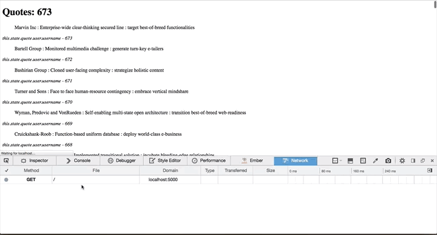

Cable
=====

A Rails 4.2 application using React and ActionCable for updates.

It will automatically update the list of quotes without AJAX. ActionCable will
push the JSON for each quote directly to React when it's created. (in the rake
task)

HowTo Get Started
-------

1. Clone it
1. `bundle && rake db:setup`
1. `foreman start` (this will start rails, action-cable's process, and a rake
   task to simulate activity. Will create one quote every 2 seconds.
1. Visit `http://localhost:5000` to see the awesome

TODO
----

1. Add ability to create a Quote
1. Add authentication
1. Add ability to follow a user for their genius level quotes

Author
======

Jesse Wolgamott, @jwo. All Rights Reserved for now.
